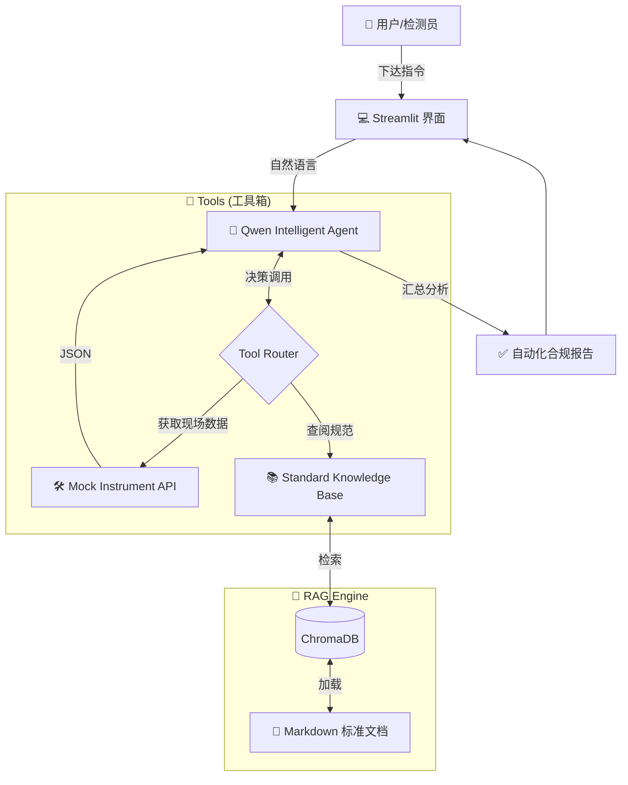

<div align="center">
  <a href="https://github.com/yourusername/inspection-ai-pilot">
    <!-- 建议替换为你的 Logo 链接，如果没有可以使用文字或这个占位图 -->
    
  </a>

  <h3 align="center">🏗️ 工程检测智能领航员 | Inspection AI Pilot</h3>

  <p align="center">
    <strong>连接检测数据与国家标准，打造“实测实量”的自动化 AI 专家</strong>
  </p>

  <p align="center">
    <!-- Python Version -->
    <a href="https://python.org">
      
    </a>
    <!-- Package Manager UV -->
    <a href="https://github.com/astral-sh/uv">
      
    </a>
    <!-- Model -->
    <a href="https://huggingface.co/Qwen">
      
    </a>
    <!-- Framework -->
    <a href="https://www.langchain.com/">
      
    </a>
    <!-- License -->
    <a href="./LICENSE">
      
    </a>
  </p>
  
  <p align="center">
    <a href="#-演示-demo">🎥 演示</a> •
    <a href="#-核心亮点-features">✨ 亮点</a> •
    <a href="#-快速开始-quick-start">⚡ 快速开始</a> •
    <a href="#-系统架构-architecture">🧩 架构</a>
  </p>
</div>

---

## 📖 项目背景 (Background)

在传统的工程检测行业（建筑、交通、地基基础）中，工程师面临两大痛点：

1.  **📚 标准繁杂**：各类 GB/JGJ 规范更新快，条款多，尤其是复杂的**换算表格**（如回弹法测强），人工查阅耗时且易错。
2.  **🏝️ 数据孤岛**：现场仪器（IoT）数据与后端标准库割裂，需要人工手动录入并核对合规性，效率低下。

**Inspection AI Pilot** 是一个验证性 MVP，旨在通过 **LLM Agent** 技术解决上述问题。它不只是一个“聊天机器人”，而是一个能干活的“数字员工”。

## 🎥 演示 (Demo)

TBD

## ✨ 核心亮点 (Features)

| 特性 | 说明 | 关键词 |
| :--- | :--- | :--- |
| **🤖 智能体架构** | 采用 ReAct 范式，AI 自主规划路径：**获取数据 -> 查阅标准 -> 逻辑判定**。 | `Agentic Workflow` |
| **📊 结构化 RAG** | 摒弃粗糙的 PDF 切片，采用 **Markdown** 重构标准文档，完美保留**表格语义**，确保查表计算准确。 | `Table Semantics` |
| **⚡ 极速环境** | 使用 Rust 编写的 **uv** 进行依赖管理，环境构建速度提升 10-100 倍。 | `Modern Tooling` |
| **🔌 模拟 IoT 集成** | 内置 Mock API 服务，模拟从现场智能检测设备实时拉取原始记录。 | `IoT Simulation` |
| **🛡️ 严格溯源** | 所有的判定依据均会索引至具体的规范条款，满足检测行业 ISO 17025 的严谨性要求。 | `Compliance` |

## ⚡ 快速开始 (Quick Start)

本项目使用 [uv](https://github.com/astral-sh/uv) 进行极速依赖管理。

### 1. 克隆仓库
```bash
git clone https://github.com/yourusername/inspection-ai-pilot.git
cd inspection-ai-pilot
```

### 2. 环境配置
确保你已安装 `uv` (极速 Python 包管理器):
```bash
# macOS/Linux
curl -LsSf https://astral.sh/uv/install.sh | sh

# Windows
powershell -c "irm https://astral.sh/uv/install.ps1 | iex"
```

使用 `uv` 创建虚拟环境并同步依赖：
```bash
# 初始化并安装依赖 (自动创建 .venv)
uv sync

# 或者仅安装依赖
uv pip install -r requirements.txt
```

### 3. 设置 API Key
复制配置文件模板：
```bash
cp .env.example .env
```
在 `.env` 中填入你的 LLM API Key (如 Qwen / OpenAI)。

### 4. 启动应用
```bash
# 通过 uv 运行 Streamlit
uv run streamlit run app.py
```

## 🧩 系统架构 (Architecture)



## 📂 目录结构

```text
inspection-ai-pilot/
├── 📂 agents/          # LangChain Agent 核心逻辑
├── 📂 knowledge_base/  # Markdown 格式的工程规范 (RAG源)
├── 📂 mock_iot/        # 模拟 IoT 设备 API
├── 📂 ui/              # Streamlit 前端代码
├── app.py              # 启动入口
├── pyproject.toml      # uv 项目配置
└── requirements.txt    # 依赖列表
```

## 🗺️ Roadmap

- [x] ✅ 完成回弹法测强（JGJ/T 23-2011）标准库构建
- [x] ✅ 实现 IoT 数据 Mock 接口
- [ ] 🚧 接入真实 MQTT 设备数据流
- [ ] 🚧 支持多模态输入（上传裂缝照片自动分析）
- [ ] 📝 生成 PDF 正式检测报告

## 🤝 贡献 (Contributing)

欢迎提交 Issue 和 PR！如果你觉得这个项目对你有帮助，请给它一个 ⭐️ **Star**！

## 📄 许可证 (License)

本项目基于 [MIT License](./LICENSE) 开源。
